Name of system: TuanShoes

Member:

- SE170186: Phan Cảnh Tuấn
  
- SE172312: Đặng Minh Tuấn An
  
- SE151518: Trần Hoàng Tuấn

1/ Customers:

REGISTER: user can enter username and password, their personal information like address, phone number, name to create account.

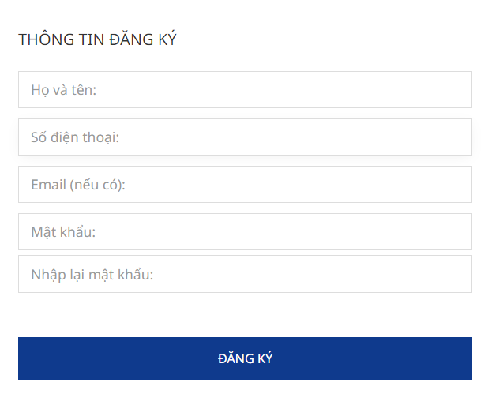

LOG IN/ LOG OUT: customer can log in a registered account and log out whenever they want.

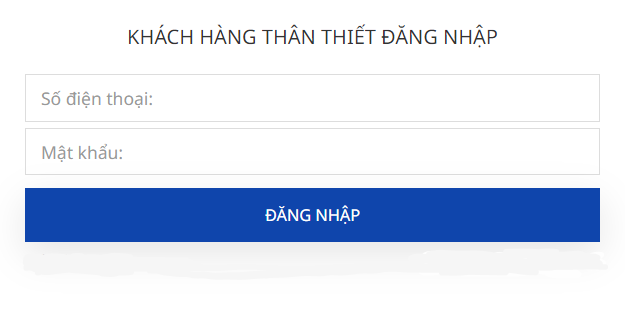

SEARCH: they can search products by name and see those products clearly.

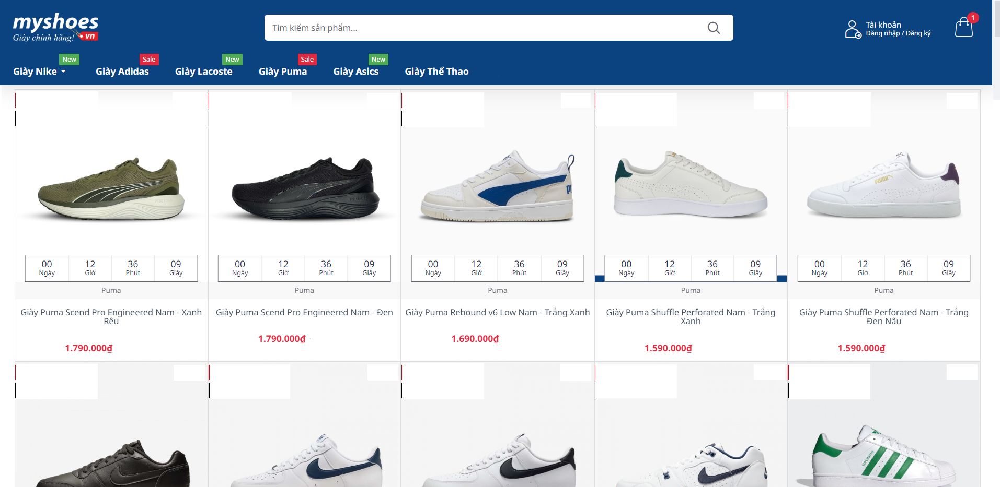

VIEW: they can see the details of the products they are looking for (pictures, description, reviews), moreover , they can see MODEL and LATEST AAN.

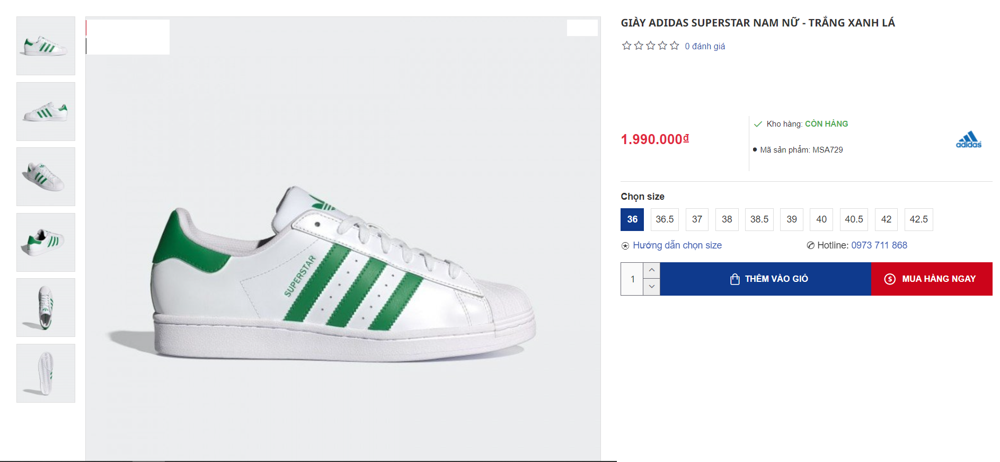

ACCOUNT INFORMATION: they can check their information and can change if something is wrong, especially they can also change their password.

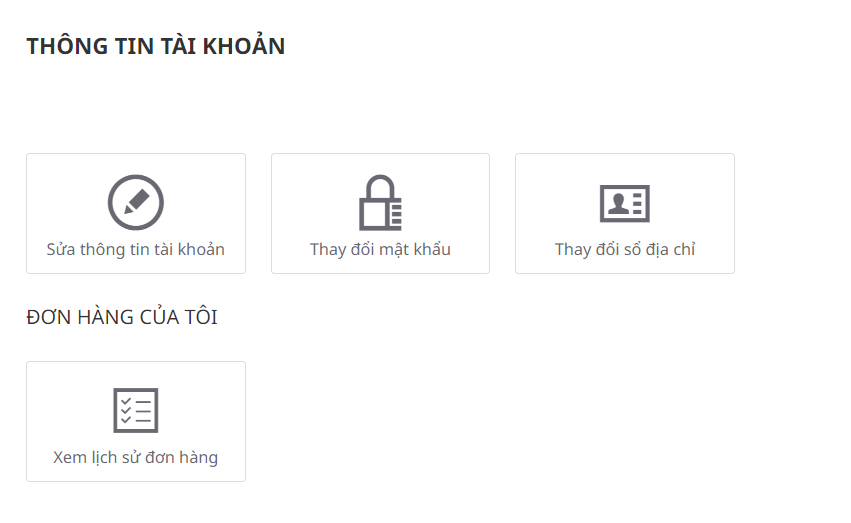

SHOPPING CART: user can add products and remove when they don't need to buy this item anymore.

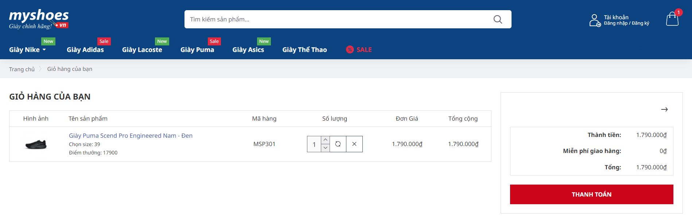

CHECK OUT: Users will see khjkjhk amount they need to pay for each items they ordered and the total amount due for their final payment.

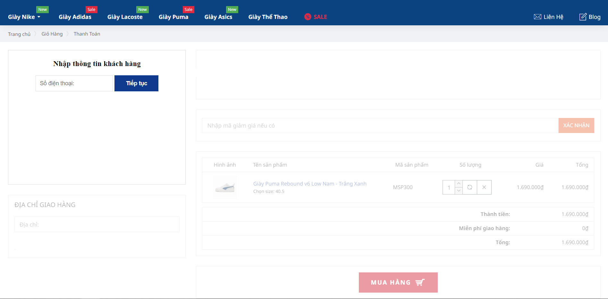

ORDER LIST: user can view order history and can q

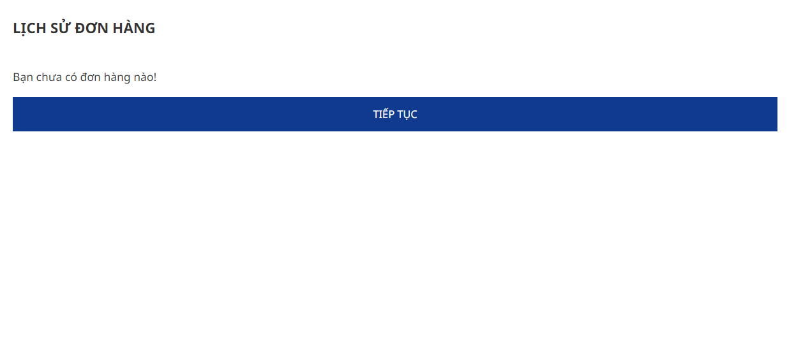

2/ Admin

LOG IN/ LOG OUT: Admin can log in with a separate account for admin to access to home page with salemanship's functions and log out when they are finished.

PRODUCT MANAGEMENT: Admins are responsible for managing products which includes adding, updating, deleting, and viewing them.

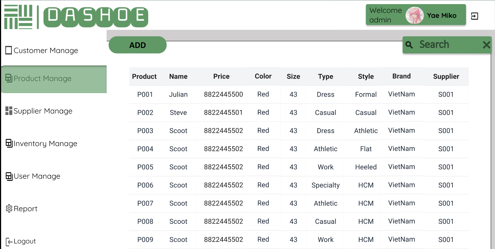

USER MANAGEMENT: Admins can handle user data by adding, updating, deleting, and viewing user profiles.

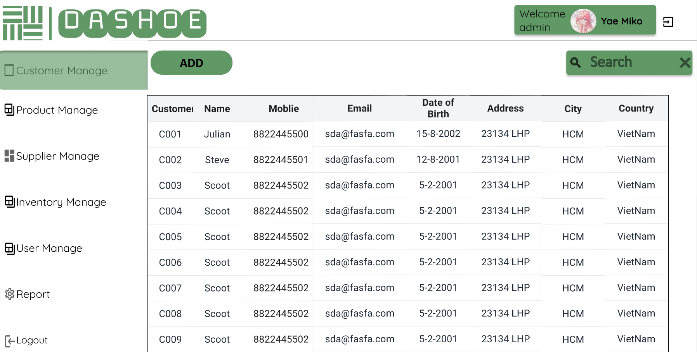

ORDER MANAGEMENT: Admin can view, update status, delete order

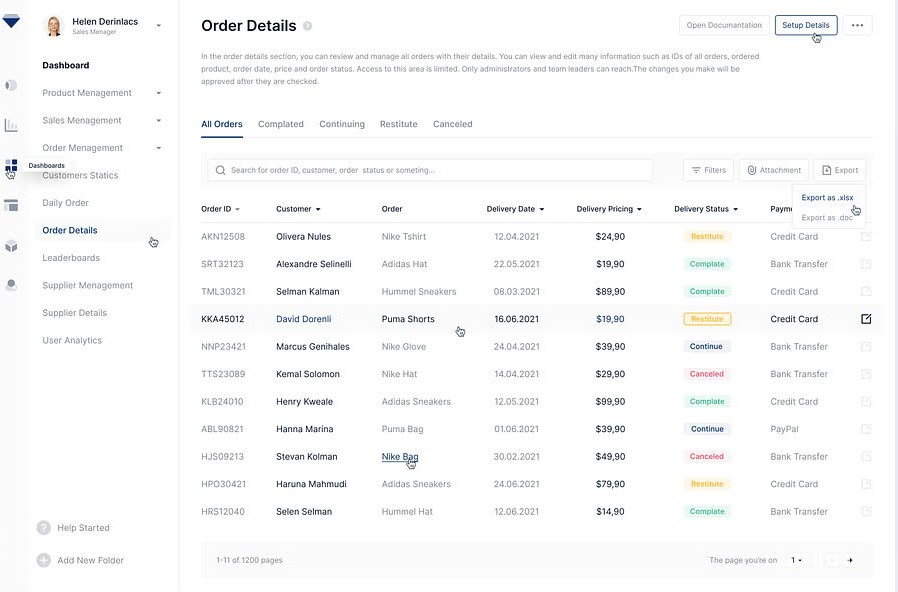

DATABASE:

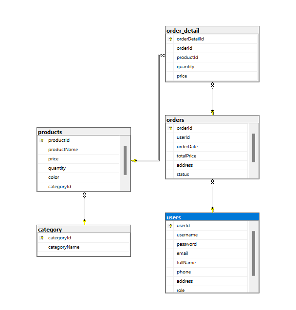

