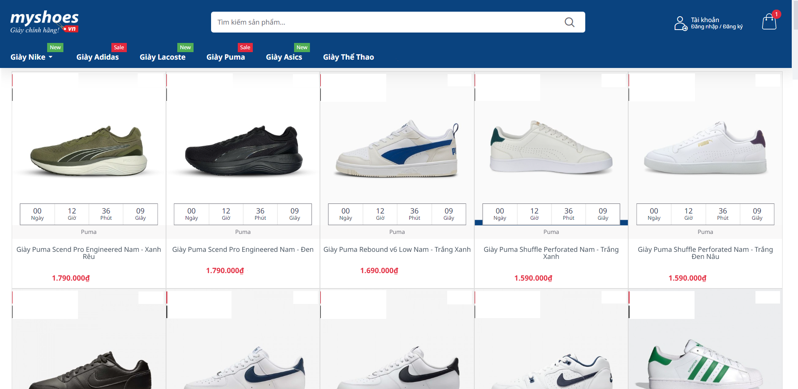
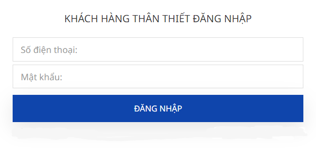
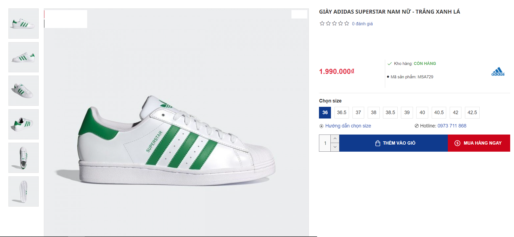
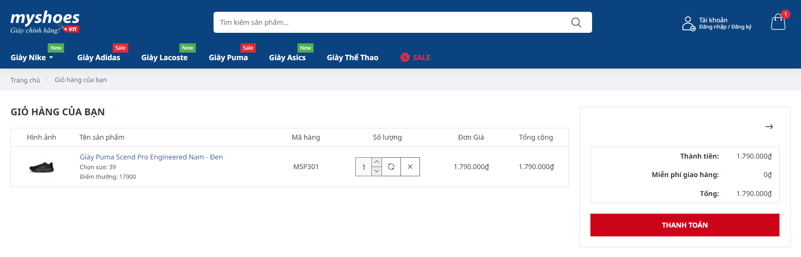
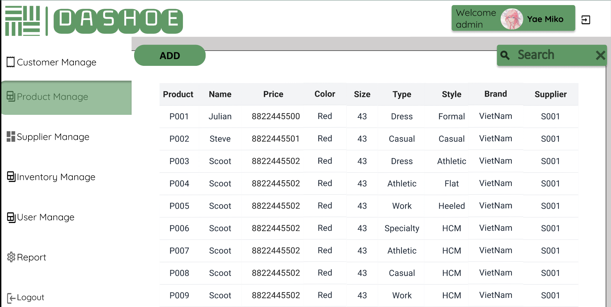
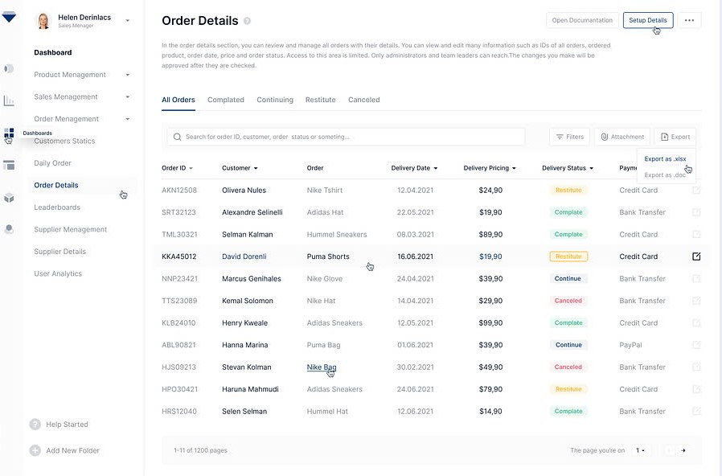

# Electro - Full-Stack E-commerce Website

This is a comprehensive e-commerce website project built on the Java Web platform. It utilizes the MVC (Model-View-Controller) architecture with Servlets as the Controller, JSP as the View, and DAO/DTO classes as the Model. The project simulates an electronics store with a full suite of features for both customers and administrators.

## Table of Contents
- [Key Features](#key-features)
- [Technology Stack](#technology-stack)
- [System Architecture](#system-architecture)
- [Database Setup](#database-setup)
- [Setup & Running Instructions](#setup--running-instructions)
- [Interface Screenshots](#interface-screenshots)

## Key Features

The project supports two primary roles: the User (Customer) and the Administrator.

### User Functionality:
-   **Authentication:** Sign up for a new account and log into the system.
-   **Product Browsing:** View products by category, browse new arrivals, and see best-selling items.
-   **Search & Filtering:** Search for products by name and filter them by category, brand, and price range.
-   **Product Details:** View detailed information, images, and reviews for each product.
-   **Shopping Cart:** Add, remove, and update the quantity of products in the cart.
-   **Checkout Process:** Place an order by providing shipping information.
-   **Account Management:** View and update personal information, address, and password.
-   **Order History:** Review past orders and their statuses.

### Admin Functionality:
-   **Admin Dashboard:** A separate login and dashboard for administrators.
-   **User Management:** View, search, and edit user account information.
-   **Product Management:** Add, edit, and delete products from the store catalog.
-   **Order Management:** View a list of all customer orders and update their statuses (e.g., processing, shipped, delivered).

## Technology Stack
-   **Backend:** Java Servlets, JSP, JSTL, JDBC.
-   **Frontend:** HTML5, CSS3, JavaScript, Bootstrap 3.
-   **Database:** Microsoft SQL Server.
-   **Web Server:** Apache Tomcat.
-   **IDE:** NetBeans.
-   **Build Tool:** Apache Ant.

## System Architecture

The project is built following the **MVC (Model - View - Controller)** architectural pattern:
-   **Model:** Consists of **DTO** (Data Transfer Object) classes that define the application's objects (User, Product, Order, etc.) and **DAO** (Data Access Object) classes that handle all database interactions via JDBC.
-   **View:** Comprises the **JSP** (`.jsp`) files responsible for rendering the user interface.
-   **Controller:** Implemented as **Java Servlets** (`.java`), which handle incoming HTTP requests, interact with the Model (DAO classes) to process business logic, and then forward the data to the appropriate View (JSP page) for presentation.

#### System Flow Diagram
*The diagram below illustrates the flow of a typical user request through the system.*

## Database Setup
1.  Open **SQL Server Management Studio**.
2.  Create a new database (e.g., `electro_db`).
3.  Open and execute the SQL script located at `database/script.sql` to create all necessary tables and seed initial data.
4.  **Important:** Open the `src/java/utils/DBUtils.java` file and update the database connection string (the `url`, `user`, and `password` variables) to match your local SQL Server configuration.

```java
// Example inside DBUtils.java
private static final String url = "jdbc:sqlserver://localhost:1433;databaseName=electro_db";
private static final String user = "sa";
private static final String password = "your_password";
```

## Setup & Running Instructions
This project was developed with NetBeans and is built using Ant. The easiest way to run it is by using the NetBeans IDE.

1.  **Prerequisites:**
    -   JDK 8 or higher.
    -   NetBeans IDE 8.2 or newer.
    -   Apache Tomcat 8 or 9.
    -   Microsoft SQL Server 2012 or newer.

2.  **Steps:**
    -   Clone this repository to your local machine.
    -   Follow the steps in the [Database Setup](#database-setup) section.
    -   Open NetBeans IDE.
    -   Go to `File` > `Open Project...` and navigate to the cloned project directory.
    -   Configure the Apache Tomcat server for the project (Right-click the project > `Properties` > `Run` > `Server` and select your configured Tomcat server).
    -   Right-click the project and select **`Clean and Build`**.
    -   After a successful build, right-click the project and select **`Run`**.
    -   The application will automatically open in your default web browser at `http://localhost:8080/{project_name}/`.

## Interface Screenshots

| Homepage | Login Page | Product Details |
| :---: | :---: | :---: |
|  |  |  |

| Shopping Cart | Admin Product Management | Admin Order Management |
| :---: | :---: | :---: |
|  |  |  |

---
